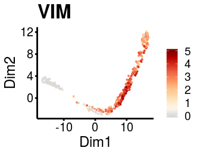
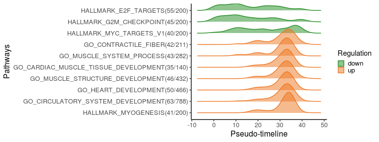
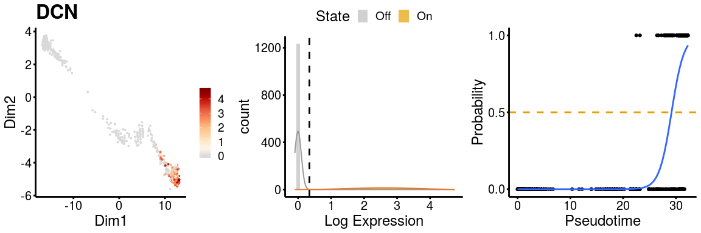

<!-- README.md is generated from README.Rmd. Please edit that file -->

# GeneSwitches

<!-- badges: start -->
[](https://github.com/SGDDNB/GeneSwitches)
<!-- badges: end -->

The goal of GeneSwitches is to discover the order of gene-expression and
functional events during cell state transitions at a single-cell
resolution. It works on any single-cell trajectory or pseudo-time
ordering of cells to discover the genes that act as on/off switches
between cell states and importantly the ordering at which these switches
take place.

## Installation

### Check and install required packages

Users may use following codes to check and install all the required
packages.

``` r
list.of.packages <- c("SingleCellExperiment", "Biobase", "fastglm", "ggplot2", "monocle",
                      "plyr", "RColorBrewer", "ggrepel", "ggridges", "gridExtra", "devtools",
                      "mixtools")

## for package "fastglm", "ggplot2", "plyr", "RColorBrewer", "ggrepel", "ggridges", "gridExtra", "mixtools"
new.packages <- list.of.packages[!(list.of.packages %in% installed.packages()[,"Package"])]
if(length(new.packages)) install.packages(new.packages)

## for package "SingleCellExperiment", "Biobase"
if (!requireNamespace("BiocManager", quietly = TRUE)) install.packages("BiocManager")
new.packages <- list.of.packages[!(list.of.packages %in% installed.packages()[,"Package"])]
if(length(new.packages)) BiocManager::install(new.packages)
```

### Install GeneSwitches

The source code of GeneSwitches can be installed from
[GitHub](https://github.com/) with:

``` r
devtools::install_github("SGDDNB/GeneSwitches")
```

## Input datasets

GeneSwitches requires two inputs, namely a gene expression matrix and
corresponding pseudo-time ordering of each cell. We convert these input
datasets in a `SingleCellExperiment` object (Lun and Risso 2017) and
below you will find a full “start-to-finish” workflow to realise the
potential of this analyis. Any additions, suggestions or comments are
welcome in the github repository.

``` r
## load libraries
library(GeneSwitches)
library(SingleCellExperiment)
```

For this vignette, we will work with a published dataset of single-cell
RNA-seq data from the differentiation of human embryonic stem cells
(hESC) to cardiomyocytes (CM) (Friedman et al., 2018). For the purpose
of demonstration, we have subset the original dataset into 3000 cells
and run Monocle2 to generate trajectories. Both the Log-normalized gene
expression and Monocle2 inferred trajectory results can be downloaded
from here as
[logexpdata.RData](http://files.ddnetbio.com/logexpdata.RData), and
[cardiac\_monocle2.RData](http://files.ddnetbio.com/cardiac_monocle2.RData).
This dataset was chosen in part because it shows a bifurcating cell fate
of cardiac hESC differentiation that gives rise to definitive
cardiomyocytes (Path1) or non-contractile cardiac derivatives (Path2)
that allow for all aspect of GeneSwitches to be applied.

``` r
## Download example files to current directory
get_example_inputData()
## Load input data log-normalized gene expression
load("./logexpdata.RData")
## Load Monocle2 object with pseudo-time and dimensionality reduction
load("./cardiac_monocle2.RData")
```

### Direct input (NOT run)

Users can input the gene expression (`logexpdata`; recommend for
log-normalized expression), pseudo-time (`cell_pseudotime`) and
dimensionality reductions (`rd_PCA`; optional and only for gene
expression plots) into SingleCellExperiment object as
follows.

``` r
### create SingleCellExperiment object with log-normalized single cell data
#sce <- SingleCellExperiment(assays = List(expdata = logexpdata))
### add pseudo-time information
#colData(sce)$Pseudotime <- cell_pseudotime
### add dimensionality reductions, e.g. PCA, UMAP, tSNE
#pca <- prcomp(t(assays(sce)$expdata), scale. = FALSE)
#rd_PCA <- pca$x[,1:2]
#reducedDims(sce) <- SimpleList(PCA = rd_PCA)
```

### Convert from trajectory results

Alternatively, GeneSwitches provides functions to convert Monocle2 or
Slingshot results into SingleCellExperiment object directly. For
Monocle2 trajectory, users need to indicate the states of the desired
path, which can be checked by plotting the trajectory using Monocle2
function `plot_cell_trajectory` or the following function.

``` r
## plot Monocle2 trajectory colored by State
# monocle:::plot_cell_trajectory(cardiac_monocle2, color_by = "State")
plot_monocle_State(cardiac_monocle2)
```


Based on the marker genes, the pseudo-time trajectory starts from State
3, which are hESC cells. Definitive CM cells are in State 1 and
non-contractile cardiac derivatives are in State 5. Therefore, we focus
on Path1 with cells in states 3, 2, 1 and Path2 with cells in states 3,
2, 5, and extract these two paths from Monocle2
object.

``` r
## Input log-normalized gene expression, Monocle2 pseudo-time and dimensionality reduction
## Path1 containing cells in states 3,2,1
sce_p1 <- convert_monocle2(monocle2_obj = cardiac_monocle2, 
                           states = c(3,2,1), expdata = logexpdata)
## Path2 containing cells in states 3,2,5
sce_p2 <- convert_monocle2(monocle2_obj = cardiac_monocle2, 
                           states = c(3,2,5), expdata = logexpdata)
```

If we are only interested in the trajectory within a certain range of
pseudotime, function `subset_pseudotime` can be used to subset the
SingleCellExperiment object accordingly, followed by filtering out lowly
expressed genes.

``` r
### Subset cells to pseudotime range from 10 to 25
#sce_p1_subset <- subset_pseudotime(sce_p1, min_time = 10, max_time = 25, minexp = 0, mincells = 10)
```

In Part I, we will apply GeneSwitches on a single trajectory, Path1, to
demonstrate the general workflow and functions. Comparison of
GeneSwitches results from two trajectories (Path1 & 2) will be shown in
Part II.

## PART I. GeneSwitches on a single trajectory

### I-1. Binarize gene expression

Since we focus on the genes that are either switched on or off, we first
binarize the gene expression data into 1(on) or 0(off) state. To achieve
this, for each gene, we fit a mixture model of two gaussian
distributions to the input gene expression to calculates gene-specific
thresholds for binarization. Prior to fitting, we add gaussian noise
with zero mean and 0.1 standard deviation to the gene expression, which
ensures numerical stability in the fitting of the gene expression. Genes
that do not have a distinct bimodal “on-off” distribution are then
removed. This step may take 2 minutes for 2000 cells using 3 cores.

``` r
### binarize gene expression using gene-specific thresholds
sce_p1 <- binarize_exp(sce_p1, ncores = 3)
```

Alternatively, we can use a global threshold for fast binarization. We
plot a histogram of expression of all the genes in all cells and look
for a break between the zero and expressed distributions to identify the
global threshold.

``` r
### check the threshold for binarization
#h <- hist(assays(sce_p1)$expdata, breaks = 200, plot = FALSE)
#{plot(h, freq = FALSE, xlim = c(0,2), ylim = c(0,1), main = "Histogram of gene expression",
#xlab = "Gene expression", col = "darkgoldenrod2", border = "grey")
#abline(v=0.2, col="blue")}

###In this example, we choose 0.2 (blue line, also set as default) as the threshold.
# bn_cutoff <- 0.2
# sce_p1 <- binarize_exp(sce_p1, fix_cutoff = TRUE, binarize_cutoff = bn_cutoff)
```

### I-2. Fit logistic regression & estimate switching time

Logistic regression is applied to model the binary states (on or off) of
gene expression. Then the switching pseudo-time point is determined by
the time at which the fitted line crosses the probability threshold 0.5.
We use random downsampling of zero expressions (downsample = TRUE) to
rescue the prediction of switching time for genes with high zero
inflation.

``` r
## fit logistic regression and find the switching pseudo-time point for each gene
## with downsampling. This step takes less than 1 mins
sce_p1 <- find_switch_logistic_fastglm(sce_p1, downsample = TRUE, show_warning = FALSE)
```

### I-3. Visualize ordering of switching genes

First, we filter poorly fitted genes based on zero-expression percentage
(\>90%), FDR (\>0.05) and McFadden’s Pseudo R^2 (\<0.03). We can then
the number of top best fitting (high McFadden’s Pseudo R^2) genes to
plot. One can also extract specific gene type(s) to plot, with provided
gene type lists containing surface proteins (downloaded from
[here](http://wlab.ethz.ch/cspa/)) and transcription factors (TFs,
downloaded from [here](http://humantfs.ccbr.utoronto.ca/)). Users are
allowed to pass their own gene type lists as a data frame to parameter
genelists, with rows as genes (non-duplicated) and two columns with name
`genenames` and `genetypes`.

``` r
## filter top 15 best fitting switching genes among all the genes
sg_allgenes <- filter_switchgenes(sce_p1, allgenes = TRUE, topnum = 15)
## filter top 15 best fitting switching genes among surface proteins and TFs only
sg_gtypes <- filter_switchgenes(sce_p1, allgenes = FALSE, topnum = 20,
                                genelists = gs_genelists, genetype = c("Surface proteins", "TFs"))
## combine switching genes and remove duplicated genes from sg_allgenes
sg_vis <- rbind(sg_gtypes, sg_allgenes[setdiff(rownames(sg_allgenes), rownames(sg_gtypes)),])
```

Finally, plot the selected genes along the pseudo-timeline. Genes that
are switched on are plotted above the line, while those switching off
are below the
line.

``` r
plot_timeline_ggplot(sg_vis, timedata = sce_p1$Pseudotime, txtsize = 3)
```


It is possible to use the dimensionality reduction provided from the
user to visualise the gene expression and logistic regression fitting
plots if
needed.

``` r
plot_gene_exp(sce_p1, gene = "VIM", reduction = "monocleRD", downsample = F)
```



### I-4. Order pathways along the pseudo-timeline

GeneSwitches can be used to order pathways or genesets as well. We
include the pathways provided by MSigDB hallmark (Liberzon,A. et al.,
2015), C2 curated and C5 gene ontology geneset collections. A
Hypergeometric test is first applied to extract the pathways that are
significantly overrepresented amongst those that are changing along the
trajectory. The Switching time of the pathway is then determined by the
median switching time of genes in that pathway.

``` r
## filter genes for pathway analysis using r^2 cutoff 0.1
sg_pw <- filter_switchgenes(sce_p1, allgenes = TRUE, r2cutoff = 0.1)
## apply hypergeometric test and determine the switching time
switch_pw <- find_switch_pathway(rowData(sce_p1), sig_FDR = 0.05,
                                 pathways = msigdb_h_c2_c5, sg_pw)
## remove redundant pathways
switch_pw_reduce <- reduce_pathways(switch_pw, pathways = msigdb_h_c2_c5, 
                                    redundant_pw_rate = 0.8)
```

To better visualise the functional changes ridge plots of pathways genes
show the density of switching genes along the pseudo-time. Top 10
significantly changed pathways are plotted here, ordered by the
switching time.

``` r
plot_pathway_density(switch_pw_reduce[1:10,], sg_pw, orderbytime = TRUE)
#> Picking joint bandwidth of 2.49
```



We can also select specific pathway(s) to plot the switching genes in
it. Among top 10 significantly changed pathways, we plot genes related
to myogenesis and cardiac muscle tissue
development.

``` r
sg_vis <- filter_switchgenes(sce_p1, topnum = 50, pathway_name = c("HALLMARK_MYOGENESIS",
                                                                "GO_CARDIAC_MUSCLE_TISSUE_DEVELOPMENT"))
plot_timeline_ggplot(sg_vis, timedata=sce_p1$Pseudotime, txtsize=3)
```


“Multiple” lables the genes in more than one pathways.

## PART II. Comparing switching genes from two trajectories

Before comparison, we need to apply same steps in I-1 and I-2 on the
cells from Path2 to identify switching pseudo-time point for each gene.

``` r
sce_p2 <- binarize_exp(sce_p2)
sce_p2 <- find_switch_logistic_fastglm(sce_p2, downsample = TRUE, show_warnings = FALSE)
```

And we filter out poorly fitted genes for both paths using the same
cutoff.

``` r
sg_p1 <- filter_switchgenes(sce_p1, allgenes = TRUE, r2cutoff = 0.03)
sg_p2 <- filter_switchgenes(sce_p2, allgenes = TRUE, r2cutoff = 0.03)
```

We then plot common switching genes between two paths to compare their
ordering.

``` r
sg_com <- common_genes(sg_p1, sg_p2, r2cutoff = 0.4,
                       path1name = "Definitive CM", path2name = "non-contractile")
common_genes_plot(sg_com, timedata = sce_p1$Pseudotime)
```


More importantly, we can plot the distinct switching genes of the two
paths.

``` r
sg_disgs <- distinct_genes(sg_p1, sg_p2, r2cutoff = 0.52,
                           path1name = "Definitive CM", path2name = "non-contractile",
                           path1time = sce_p1$Pseudotime, path2time = sce_p2$Pseudotime)
plot_timeline_ggplot(sg_disgs, timedata = sce_p1$Pseudotime, color_by = "Paths", 
                     iffulltml = FALSE, txtsize = 3)
```


We can also scale the timelines to be the same length (default number of
bins is 100) so that differences are based on percentage of the
trajectory covered rather than pseudo-time.

``` r
sg_disgs_scale <- distinct_genes(sg_p1, sg_p2, r2cutoff = 0.52, 
                                 path1name = "Definitive CM", path2name = "non-contractile",
                                 path1time = sce_p1$Pseudotime, path2time = sce_p2$Pseudotime, 
                                 scale_timeline = T, bin = 100)
# timedata need to be 1 to (number of bins)
plot_timeline_ggplot(sg_disgs_scale, timedata = 1:100, color_by = "Paths", 
                     iffulltml = FALSE, txtsize = 3)
```


These two plots for distinct switching genes only show a range of
pseudo-timeline in which there are switching events happening. This
range is actually at the end of trajectories, while common genes are
mostly at the early period (common gene plot).

Similarly, we can check the gene expression plots for the two paths.

``` r
gn <- "DCN"
p <- plot_gene_exp(sce_p1, gene = gn, reduction = "monocleRD", 
                   downsample = FALSE, fitting = TRUE)
#> Warning: glm.fit: algorithm did not converge
```


``` r
p <- plot_gene_exp(sce_p2, gene = gn, reduction = "monocleRD", 
                   downsample = FALSE, fitting = TRUE)
```


